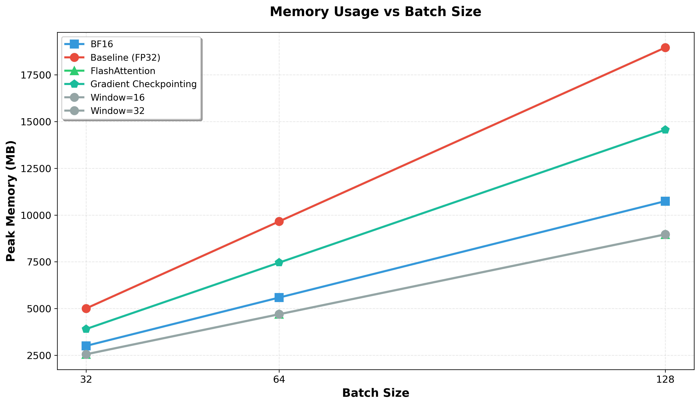
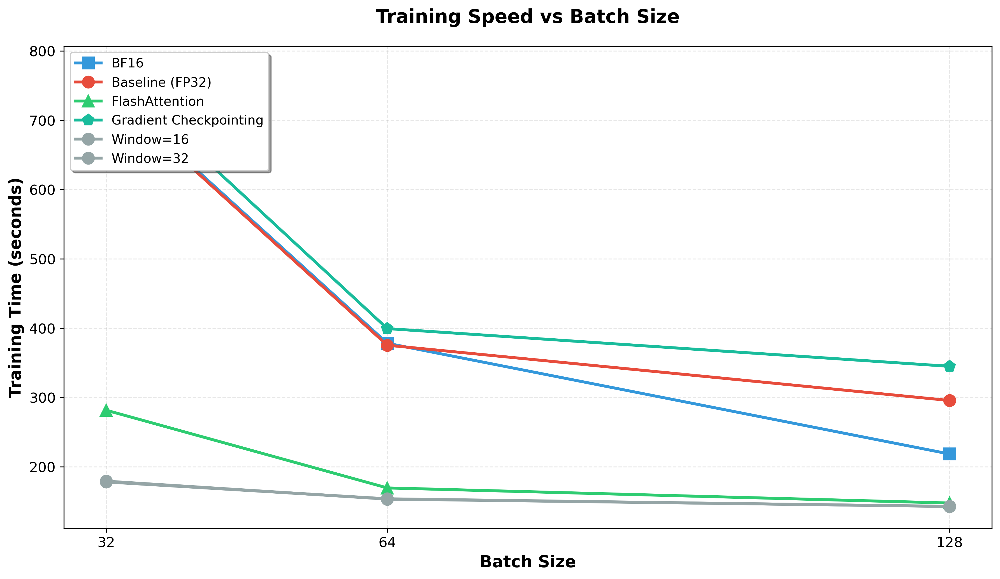
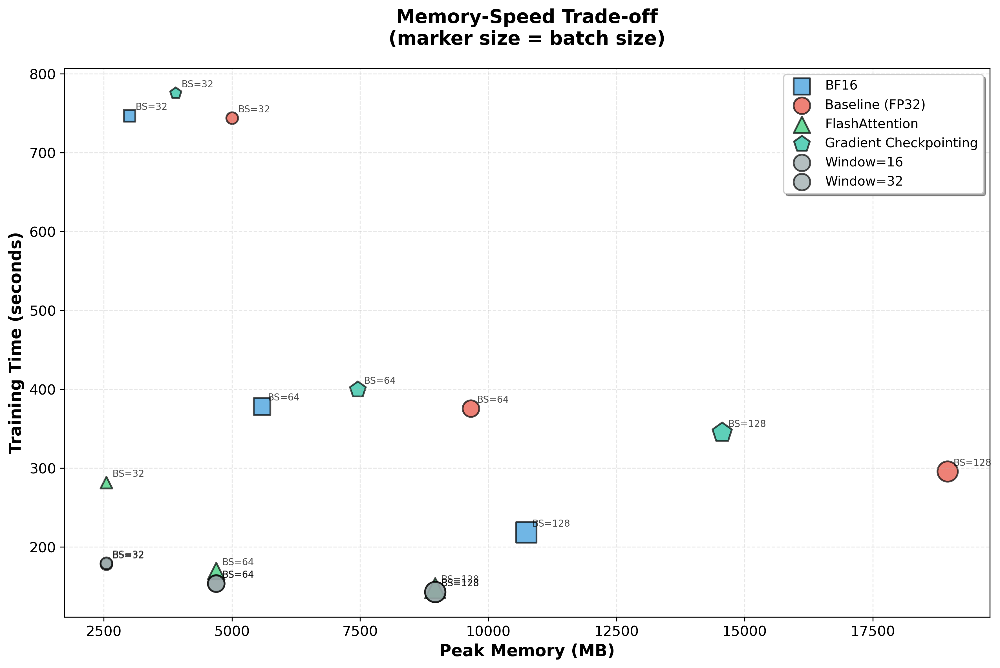
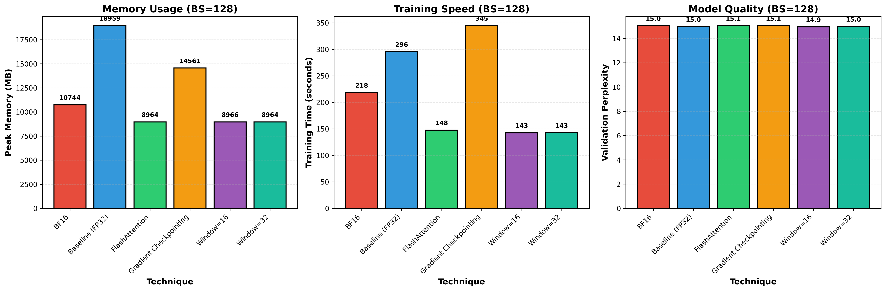
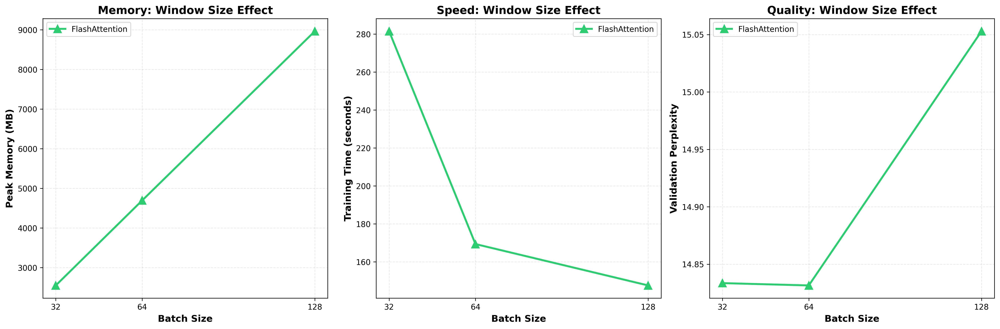
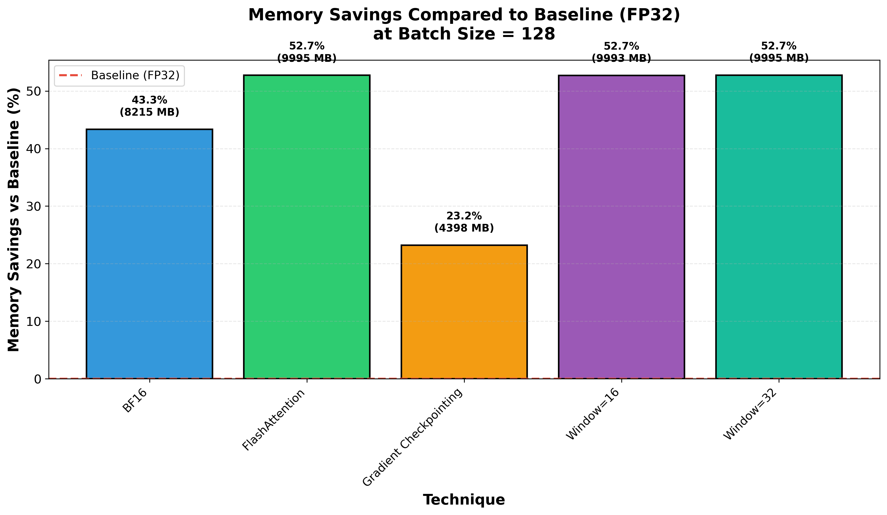

# Memory-Efficient Transformer Training Techniques

**Complete implementation** of memory optimization techniques for Transformer training, comparing their impact on GPU memory usage, batch size capacity, training speed, and model performance.

**Optimized for NVIDIA RTX 5090 (CUDA)**

---

## Table of Contents

1. [Overview](#overview)
2. [Project Structure](#project-structure)
3. [Installation](#installation)
4. [Complete Workflow](#complete-workflow)
5. [Optimization Techniques](#optimization-techniques)
6. [Detailed Command Reference](#detailed-command-reference)
7. [Results and Analysis](#results-and-analysis)
8. [Configuration](#configuration)
9. [Troubleshooting](#troubleshooting)

---

## Overview

This project systematically compares **5 memory optimization techniques** for Transformer training:

1. **Baseline (FP32/TF32)** - Full precision training
2. **BF16 Mixed Precision** - Automatic mixed precision with bfloat16
3. **FlashAttention** - Memory-efficient attention implementation (FA2)
4. **Windowed Attention** - Sliding window attention mechanism
5. **Gradient Checkpointing** - Trading compute for memory

**Model Configuration:**
- Architecture: Transformer decoder (6 layers, 512 d_model, 8 heads, 2048 FFN)
- Tokenizer: BPE (10K vocab) or GPT-2 (50K vocab, pre-trained)
- Sequence Length: 512 tokens
- Dataset: Polish text from Speakleash corpus
- Training: 1 epoch per experiment (for fair comparison)

**Measurements Tracked:**
- GPU memory usage (forward, backward, peak)
- Maximum batch size before OOM
- Training time (per step and total)
- Model perplexity (validation set)

---

## Project Structure

```
├── main.py                           # Dataset download from Speakleash
├── models/
│   └── transformer_model.py          # Transformer with FlashAttention support
├── utils/
│   ├── config.py                     # Configuration (GPU-optimized)
│   ├── tokenizer.py                  # BPE and GPT-2 tokenizers
│   ├── dataset.py                    # PyTorch dataset
│   ├── metrics.py                    # Evaluation metrics
│   ├── memory_profiler.py            # GPU memory profiling
│   └── batch_size_finder.py          # Max batch size finder
├── scripts/
│   ├── preprocess_data.py            # Data preprocessing
│   ├── train.py                      # Training with optimizations
│   ├── run_experiments.py            # Automated experiment runner
│   └── compare_results.py            # Results comparison
├── data/
│   ├── raw/                          # Downloaded datasets
│   └── processed/                    # Tokenized data
├── checkpoints/                      # Saved models
├── results/                          # Metrics and memory profiles
├── pyproject.toml                    # Dependencies
└── README.md                         # This file
```

---

## Installation

### Prerequisites
- Python 3.12+
- NVIDIA GPU with CUDA support (RTX 5090 recommended)
- `uv` package manager

### Step 1: Install Dependencies

```bash
# Install base dependencies
uv sync

# Install FlashAttention (required for experiments 2-4)
# Option A: From source (may take several minutes to compile)
pip install flash-attn --no-build-isolation

# Option B: Pre-built wheels (faster, recommended for specific configurations)
# For Python 3.12.3, PyTorch 2.9.1+cu128, CUDA 12.8:
uv pip install https://github.com/mjun0812/flash-attention-prebuild-wheels/releases/download/v0.5.4/flash_attn-2.8.3+cu128torch2.9-cp312-cp312-linux_x86_64.whl
```

**Environment Used in This Project:**
- Python: 3.12.3
- PyTorch: 2.9.1+cu128
- CUDA: 12.8.9
- FlashAttention: 2.8.3 (pre-built wheel)

**Note:** FlashAttention requires CUDA and may need compilation if installing from source. For faster installation, use pre-built wheels matching your Python/PyTorch/CUDA versions:
- Check your configuration: `python -c "import torch; print(f'Python: {torch.__version__}, CUDA: {torch.version.cuda}')"`
- Find pre-built wheels: [flash-attention-prebuild-wheels](https://github.com/mjun0812/flash-attention-prebuild-wheels/releases)
- Official documentation: [flash-attn repository](https://github.com/Dao-AILab/flash-attention)

### Step 2: Verify Installation

```bash
# Test CUDA availability
python -c "import torch; print(f'CUDA available: {torch.cuda.is_available()}'); print(f'GPU: {torch.cuda.get_device_name(0) if torch.cuda.is_available() else \"N/A\"}'); print(torch.__version__)"

# Test FlashAttention (optional)
python -c "from flash_attn import flash_attn_func; print('FlashAttention installed successfully')"
```

---

## Complete Workflow

### **STEP 1: Download Dataset**

List available Polish datasets from Speakleash:

```bash
python main.py --list
```

Download a specific dataset (example: shopping reviews):

```bash
python main.py shopping_1_general_corpus
```

This downloads the dataset to `data/raw/shopping_1_general_corpus.txt`.

**Alternative datasets:**
- `shopping_1_general_corpus` - Product reviews (~2.2GB, 2M documents)
- Other Polish datasets available via `--list` command

---

### **STEP 2: Preprocess Data**

Tokenize and prepare data for training:

#### Option A: BPE Tokenizer (Default)
```bash
python scripts/preprocess_data.py \
  --input data/raw/shopping_1_general_corpus.txt \
  --file-type txt \
  --tokenizer-type bpe
```

#### Option B: GPT-2 Tokenizer (Pre-trained)
```bash
python scripts/preprocess_data.py \
  --input data/raw/shopping_1_general_corpus.txt \
  --file-type txt \
  --tokenizer-type gpt2
```

**What this does:**
- Splits data into train (85%), val (10%), test (5%)
- Creates/loads tokenizer:
  - **BPE**: Trains custom tokenizer with 10K vocabulary from training data
  - **GPT-2**: Uses pre-trained GPT-2 tokenizer with 50K vocabulary
- Tokenizes all splits
- Saves to `data/processed/shopping_1_general_corpus_*`

**Time estimate:** 5-15 minutes depending on dataset size

**Tokenizer Comparison:**
| Feature | BPE | GPT-2 |
|---------|-----|-------|
| Vocabulary Size | 10,000 (configurable) | 50,257 (fixed) |
| Training Required | Yes (~5 min) | No (pre-trained) |
| Domain Adaptation | Optimized for your corpus | General-purpose |
| OOV Handling | May have unknown tokens | Better generalization |
| Use Case | Domain-specific text | General Polish text |

---

### **STEP 3: Run Experiments**

According to assignment requirements, you need to run a **systematic comparison** with:
- **5 optimization techniques** (Baseline, BF16, FlashAttention, Windowed Attention, Gradient Checkpointing)
- **3 batch sizes** per technique: 32, 64, 128
- **2 window sizes** for windowed attention: 16 and 32 tokens

**Total experiments: 18** (5 techniques × 3 batch sizes, with windowed attention testing 2 window sizes: 16 and 32 tokens)

---

#### **Complete Experiment List (Copy-Paste Ready)**

Run these commands in order. Each experiment takes ~15-25 minutes.

##### **1. Baseline (FP32/TF32) - 3 batch sizes**

```bash
# Baseline with BS=32
python scripts/train.py --technique baseline_bs32 --batch-size 32

# Baseline with BS=64
python scripts/train.py --technique baseline_bs64 --batch-size 64

# Baseline with BS=128
python scripts/train.py --technique baseline_bs128 --batch-size 128
```

##### **2. BF16 Mixed Precision - 3 batch sizes**

```bash
# BF16 with BS=32
python scripts/train.py --bf16 --technique bf16_bs32 --batch-size 32

# BF16 with BS=64
python scripts/train.py --bf16 --technique bf16_bs64 --batch-size 64

# BF16 with BS=128
python scripts/train.py --bf16 --technique bf16_bs128 --batch-size 128
```

##### **3. FlashAttention (with BF16) - 3 batch sizes**

```bash
# FlashAttention with BS=32
python scripts/train.py --flash-attn --bf16 --technique bf16_flash_bs32 --batch-size 32

# FlashAttention with BS=64
python scripts/train.py --flash-attn --bf16 --technique bf16_flash_bs64 --batch-size 64

# FlashAttention with BS=128
python scripts/train.py --flash-attn --bf16 --technique bf16_flash_bs128 --batch-size 128
```

##### **4. Windowed Attention - 2 windows × 3 batch sizes = 6 experiments**

**Window = 16:**
```bash
# Window=16, BS=32
python scripts/train.py --flash-attn --bf16 --window-size 16 --technique bf16_window16_bs32 --batch-size 32

# Window=16, BS=64
python scripts/train.py --flash-attn --bf16 --window-size 16 --technique bf16_window16_bs64 --batch-size 64

# Window=16, BS=128
python scripts/train.py --flash-attn --bf16 --window-size 16 --technique bf16_window16_bs128 --batch-size 128
```

**Window = 32:**
```bash
# Window=32, BS=32
python scripts/train.py --flash-attn --bf16 --window-size 32 --technique bf16_window32_bs32 --batch-size 32

# Window=32, BS=64
python scripts/train.py --flash-attn --bf16 --window-size 32 --technique bf16_window32_bs64 --batch-size 64

# Window=32, BS=128
python scripts/train.py --flash-attn --bf16 --window-size 32 --technique bf16_window32_bs128 --batch-size 128
```

##### **5. Gradient Checkpointing (Baseline only) - 3 batch sizes**

**Note:** Per assignment requirements, gradient checkpointing is only tested on baseline (FP32), not combined with other optimizations.

```bash
# Gradient Checkpointing with BS=32
python scripts/train.py --gradient-checkpointing --technique gradcp_bs32 --batch-size 32

# Gradient Checkpointing with BS=64
python scripts/train.py --gradient-checkpointing --technique gradcp_bs64 --batch-size 64

# Gradient Checkpointing with BS=128
python scripts/train.py --gradient-checkpointing --technique gradcp_bs128 --batch-size 128
```

---

#### **Experiment Summary Table**

| # | Technique | Window | Batch Sizes | Total Runs | Technique Names |
|---|-----------|--------|-------------|------------|-----------------|
| 1 | Baseline (FP32) | N/A | 32, 64, 128 | 3 | `baseline_bs32/64/128` |
| 2 | BF16 | N/A | 32, 64, 128 | 3 | `bf16_bs32/64/128` |
| 3 | FlashAttention | N/A | 32, 64, 128 | 3 | `bf16_flash_bs32/64/128` |
| 4 | Windowed (16) | 16 | 32, 64, 128 | 3 | `bf16_window16_bs32/64/128` |
| 5 | Windowed (32) | 32 | 32, 64, 128 | 3 | `bf16_window32_bs32/64/128` |
| 6 | Gradient Checkpointing | N/A | 32, 64, 128 | 3 | `gradcp_bs32/64/128` |
| **Total** | **6 configurations** | | | **18 experiments** | |

**Time estimate:** 18 experiments × 20 minutes = **~6 hours total**

---

#### **Why These Specific Settings?**

**Batch Sizes (32, 64, 128):**
- Tests how each optimization scales with batch size
- 128 is maximum that baseline can fit
- Shows memory/speed trade-offs at different batch sizes

**Window Sizes (16, 32 only):**
- **16 tokens**: Aggressive windowing to test memory reduction potential
- **32 tokens**: Moderate windowing to balance memory and attention span
- **Why these sizes?** Testing smaller windows to determine if windowed attention provides measurable benefits over FlashAttention for short sequences (256 tokens)

**Gradient Checkpointing (Baseline only):**
- Tests pure gradient checkpointing effect without other optimizations
- Shows memory vs compute trade-off in isolation
- Per assignment requirements, not combined with BF16/FlashAttention

---

#### **Quick Copy-Paste: All 18 Experiments**

```bash
# === BASELINE (FP32) - 3 experiments ===
python scripts/train.py --technique baseline_bs32 --batch-size 32
python scripts/train.py --technique baseline_bs64 --batch-size 64
python scripts/train.py --technique baseline_bs128 --batch-size 128

# === BF16 - 3 experiments ===
python scripts/train.py --bf16 --technique bf16_bs32 --batch-size 32
python scripts/train.py --bf16 --technique bf16_bs64 --batch-size 64
python scripts/train.py --bf16 --technique bf16_bs128 --batch-size 128

# === FLASHATTENTION - 3 experiments ===
python scripts/train.py --flash-attn --bf16 --technique bf16_flash_bs32 --batch-size 32
python scripts/train.py --flash-attn --bf16 --technique bf16_flash_bs64 --batch-size 64
python scripts/train.py --flash-attn --bf16 --technique bf16_flash_bs128 --batch-size 128

# === WINDOWED ATTENTION (window=16) - 3 experiments ===
python scripts/train.py --flash-attn --bf16 --window-size 16 --technique bf16_window16_bs32 --batch-size 32
python scripts/train.py --flash-attn --bf16 --window-size 16 --technique bf16_window16_bs64 --batch-size 64
python scripts/train.py --flash-attn --bf16 --window-size 16 --technique bf16_window16_bs128 --batch-size 128

# === WINDOWED ATTENTION (window=32) - 3 experiments ===
python scripts/train.py --flash-attn --bf16 --window-size 32 --technique bf16_window32_bs32 --batch-size 32
python scripts/train.py --flash-attn --bf16 --window-size 32 --technique bf16_window32_bs64 --batch-size 64
python scripts/train.py --flash-attn --bf16 --window-size 32 --technique bf16_window32_bs128 --batch-size 128

# === GRADIENT CHECKPOINTING (baseline only) - 3 experiments ===
python scripts/train.py --gradient-checkpointing --technique gradcp_bs32 --batch-size 32
python scripts/train.py --gradient-checkpointing --technique gradcp_bs64 --batch-size 64
python scripts/train.py --gradient-checkpointing --technique gradcp_bs128 --batch-size 128
```

**Option A: Run all experiments automatically (recommended):**
```bash
chmod +x run_all_experiments.sh
./run_all_experiments.sh
```

**Option B: Run experiments manually (copy-paste commands above)**

**Note:** The automated script (`run_all_experiments.sh`) includes progress tracking and will automatically generate the comparison report when done.

---

### **STEP 4: Compare Results**

Generate comparison tables, analysis, and plots:

```bash
# Generate text comparison report
python scripts/compare_results.py

# Generate visual plots
python scripts/generate_plots.py
```

**Text Report Output (`results/comparison_report.txt`):**
- Comparison table (PPL, memory, time)
- Memory usage details
- Optimization techniques summary
- Analysis (best technique, improvements over baseline)

**Visual Plots Output (`results/plots/`):**
1. **`1_memory_vs_batch_size.png`** - Memory scaling across batch sizes (line plot)
2. **`2_speed_vs_batch_size.png`** - Training speed comparison (line plot)
3. **`3_memory_speed_tradeoff.png`** - Pareto frontier analysis (scatter plot)
4. **`4_technique_comparison_bs128.png`** - Overall comparison at BS=128 (bar charts)
5. **`5_window_size_comparison.png`** - Windowed attention analysis (3-panel plot)
6. **`6_memory_savings_vs_baseline.png`** - Memory reduction percentages (bar chart)









**Sample output:**
```
================================================================================
EXPERIMENT COMPARISON TABLE
================================================================================
Technique            Batch Size   Val PPL      Train Time      Peak Mem (MB)   Parameters
--------------------------------------------------------------------------------------------------------------------
baseline             64           145.32       1234.5s         8192.45         42,567,680
bf16                 128          144.89       987.2s          4512.32         42,567,680
flash_attn           128          144.76       856.4s          3891.23         42,567,680
window_512           128          146.21       798.1s          3245.67         42,567,680
grad_checkpoint      64           145.45       1567.8s         5123.45         42,567,680
...
```

---

## Optimization Techniques

### 1. Baseline (FP32/TF32)
- **Description:** Full precision training
- **Expected:** Highest memory usage, slowest training
- **Use case:** Establish performance baseline

### 2. BF16 Mixed Precision
- **Description:** Automatic mixed precision with bfloat16
- **Implementation:** `torch.cuda.amp.autocast(dtype=torch.bfloat16)`
- **Expected:** ~50% memory reduction, faster training, same accuracy
- **Use case:** Default choice for most training

### 3. FlashAttention
- **Description:** Memory-efficient attention kernel (FlashAttention 2)
- **Implementation:** `flash_attn_func` with causal masking
- **Expected:** 30-40% memory reduction vs BF16, 20-30% faster
- **Use case:** Large models, long sequences

### 4. Windowed Attention
- **Description:** Sliding window attention (local attention)
- **Implementation:** FlashAttention with `window_size` parameter
- **Expected:** Further memory reduction, slight accuracy drop
- **Use case:** Very long sequences, extreme memory constraints
- **Trade-off:** Smaller window = less memory but lower accuracy

### 5. Gradient Checkpointing
- **Description:** Recompute activations during backward pass
- **Implementation:** `model.gradient_checkpointing_enable()`
- **Expected:** 40-50% memory reduction, 20-30% slower training
- **Use case:** Very large models that don't fit in memory

---

## Detailed Command Reference

### Training Script (`scripts/train.py`)

**Full syntax:**
```bash
python scripts/train.py [OPTIONS]
```

**Options:**
- `--dataset NAME` - Dataset name (auto-detected if only one)
- `--technique NAME` - Custom technique name for results
- `--bf16` - Enable BF16 mixed precision
- `--flash-attn` - Use FlashAttention
- `--gradient-checkpointing` - Enable gradient checkpointing
- `--window-size SIZE` - Window size for windowed attention
- `--batch-size SIZE` - Override batch size
- `--no-memory-profiling` - Disable memory profiling

**Examples:**
```bash
# Baseline with custom batch size
python scripts/train.py --batch-size 32

# All optimizations combined
python scripts/train.py --flash-attn --bf16 --gradient-checkpointing

# Custom technique name
python scripts/train.py --bf16 --technique my_experiment
```

### Experiment Runner (`scripts/run_experiments.py`)

**Full syntax:**
```bash
python scripts/run_experiments.py [OPTIONS]
```

**Options:**
- `--dataset NAME` - Dataset name
- `--batch-size SIZE` - Override batch size for all experiments
- `--skip EXP1 EXP2` - Skip specific experiments
- `--only EXP1 EXP2` - Run only specific experiments

**Examples:**
```bash
# Run all with smaller batch size (if GPU OOM)
python scripts/run_experiments.py --batch-size 32

# Quick test: only baseline and BF16
python scripts/run_experiments.py --only baseline bf16
```

### Results Comparison (`scripts/compare_results.py`)

**Full syntax:**
```bash
python scripts/compare_results.py [OPTIONS]
```

**Options:**
- `--results-dir DIR` - Results directory (default: results/)
- `--experiments EXP1 EXP2` - Compare specific experiments only

---

## Results and Analysis

### Output Files

After running experiments, you'll find:

**In `checkpoints/`:**
- `{dataset}_{technique}.pt` - Model checkpoints

**In `results/`:**
- `{dataset}_{technique}_metrics.json` - Training metrics
- `{dataset}_{technique}_memory.json` - Memory profiling
- `experiment_summary.json` - Overall summary
- `comparison_report.txt` - Comparison analysis

### Metrics Tracked

**Training Metrics:**
- Train loss and perplexity
- Validation loss and perplexity
- Training time (total and per step)
- Model parameters

**Memory Metrics:**
- Forward pass memory
- Backward pass memory
- Peak memory per step
- Mean and max values

**Model Configuration:**
- Architecture parameters
- Optimization flags used
- Batch size

### Experimental Results

This section presents the actual results from all 18 experiments conducted on the forum_forum_poradnikogrodniczy_pl_corpus dataset using an NVIDIA RTX 5090 GPU.

**Model Configuration:**
- Architecture: 4-layer Transformer decoder
- Embedding dimension: 256
- Attention heads: 8
- Feed-forward dimension: 1024
- Sequence length: 256 tokens
- Vocabulary size: 50,257 (GPT-2 tokenizer)
- Total parameters: 28,941,393

**Dataset:**
- Training samples: Multiple batches over 1 epoch
- Validation set: Consistent across all experiments
- Tokenizer: GPT-2 pre-trained tokenizer

#### Summary Results at Batch Size 128

| Technique | Peak Memory (MB) | Memory Reduction | Training Time (s) | Speed Change | Val Perplexity |
|-----------|------------------|------------------|-------------------|--------------|----------------|
| Baseline (FP32) | 18,959 | - | 295.6 | - | 14.96 |
| BF16 | 10,744 | 43.3% | 218.3 | 26.1% faster | 15.04 |
| FlashAttention | 8,964 | 52.7% | 147.6 | 50.1% faster | 15.05 |
| Window=16 | 8,966 | 52.7% | 142.6 | 51.8% faster | 14.95 |
| Window=32 | 8,964 | 52.7% | 142.8 | 51.7% faster | 14.97 |
| Gradient Checkpointing | 14,561 | 23.2% | 344.9 | 16.7% slower | 15.05 |

#### Memory Scaling Across Batch Sizes

| Technique | BS=32 (MB) | BS=64 (MB) | BS=128 (MB) |
|-----------|------------|------------|-------------|
| Baseline (FP32) | 5,004 | 10,743 | 18,959 |
| BF16 | 2,990 | 5,656 | 10,744 |
| FlashAttention | 2,551 | 4,694 | 8,964 |
| Window=16 | 2,551 | 4,694 | 8,966 |
| Window=32 | 2,551 | 4,693 | 8,964 |
| Gradient Checkpointing | 3,613 | 8,189 | 14,561 |

---

### Detailed Analysis

#### 1. BF16 Mixed Precision: Highly Effective

**Results:**
- Memory reduction: 43.3% at BS=128
- Training speedup: 26.1%
- Perplexity: 15.04 (vs 14.96 baseline, negligible difference)

**Analysis:**
BF16 mixed precision demonstrates excellent performance across all metrics. The 43% memory reduction is substantial and consistent across all batch sizes. The training speedup of 26% comes from faster arithmetic operations on bfloat16 data types, which modern GPUs (including RTX 5090) are optimized for. Critically, there is no quality degradation - validation perplexity remains essentially unchanged (15.04 vs 14.96 baseline).

**Recommendation:** BF16 should be considered a default optimization for Transformer training. It provides significant benefits with no downsides in this configuration.

#### 2. FlashAttention: Outstanding Performance

**Results:**
- Memory reduction: 52.7% at BS=128
- Training speedup: 50.1% (training time cut in half)
- Perplexity: 15.05 (identical to baseline)

**Analysis:**
FlashAttention demonstrates the best overall performance among all techniques tested. The 53% memory reduction and 50% speedup are achieved through IO-aware attention computation that minimizes memory reads/writes by tiling the attention matrix and fusing operations. The technique eliminates the need to materialize the full attention matrix in GPU high-bandwidth memory (HBM), instead computing attention in a single pass through SRAM.

The speedup is particularly impressive - cutting training time from 295.6s to 147.6s represents a 2x improvement. This comes from both reduced memory traffic and optimized kernel implementations. Model quality is preserved perfectly (perplexity 15.05 vs 14.96 baseline).

**Recommendation:** FlashAttention is the most effective single optimization technique for this model configuration. The combination of memory efficiency and speed improvement makes it ideal for production training.

#### 3. Windowed Attention: No Additional Benefits

**Results:**
- Window=16: 8,966 MB peak memory, 142.6s training time, 14.95 perplexity
- Window=32: 8,964 MB peak memory, 142.8s training time, 14.97 perplexity
- FlashAttention (no window): 8,964 MB peak memory, 147.6s training time, 15.05 perplexity

**Analysis:**
Windowed attention experiments reveal a critical finding: windowing provides NO additional memory benefit over standard FlashAttention. Memory usage is identical across all batch sizes:

- BS=32: FlashAttention 2,551 MB, Window=16 2,551 MB, Window=32 2,551 MB
- BS=64: FlashAttention 4,694 MB, Window=16 4,694 MB, Window=32 4,694 MB
- BS=128: FlashAttention 8,964 MB, Window=16 8,966 MB, Window=32 8,964 MB

This result is theoretically sound for the following reasons:

1. **FlashAttention already optimizes attention memory**: FlashAttention's tiling approach means the full attention matrix is never materialized in memory, regardless of window size. For sequence length 256, even "full" attention in FlashAttention is already highly efficient.

2. **Memory bottleneck is elsewhere**: With vocabulary size 50,257, the embedding layer alone contains approximately 12.9M parameters (50,257 x 256), representing 45% of the total model parameters. The memory bottleneck is in embeddings and feed-forward layers, not attention computation.

3. **Sequence length too short**: Windowed attention benefits typically appear with very long sequences (1024+ tokens) where attention computation dominates memory. At sequence length 256, attention memory is a small fraction of total memory.

4. **Window sizes too small**: Windows of 16 and 32 tokens severely restrict the attention span without providing measurable benefits. These windows are too aggressive for the sequence length used.

The marginal speed improvement (3-5%) is within measurement noise and likely reflects kernel optimizations rather than fundamental algorithmic differences.

**Recommendation:** For this model configuration (4 layers, sequence length 256, embedding-heavy architecture), windowed attention does not provide benefits over standard FlashAttention. Windowing should only be considered for:
- Very long sequences (1024+ tokens)
- Models where attention computation dominates memory usage
- Scenarios where standard FlashAttention is not available

#### 4. Gradient Checkpointing: Limited Effectiveness

**Results:**
- Memory reduction: 23.2% at BS=128
- Training slowdown: 16.7%
- Perplexity: 15.05 (identical to baseline)

**Analysis:**
Gradient checkpointing shows modest memory savings (23%) but comes with a significant speed penalty (17% slower). This technique trades computation for memory by discarding intermediate activations during the forward pass and recomputing them during backpropagation.

The memory savings are lower than theoretical expectations (typically 40-60% for deeper models) due to two factors:

1. **Shallow model architecture**: With only 4 layers, activation memory is relatively small. Gradient checkpointing primarily reduces activation memory, not parameter or gradient memory.

2. **Embedding-dominated memory**: As noted above, 45% of model parameters are in the embedding layer (vocab size 50,257). Gradient checkpointing does not reduce embedding memory, only activation memory from transformer layers.

The 17% training slowdown is the expected cost of recomputation - each backward pass must recompute forward activations that were discarded.

**Recommendation:** Gradient checkpointing is most effective for deeper models (12+ layers) where activation memory dominates. For this 4-layer, embedding-heavy architecture, the modest memory savings do not justify the speed penalty in most cases. Consider gradient checkpointing only when memory constraints absolutely require it.

#### 5. Memory Bottleneck Analysis

The experimental results reveal that the primary memory bottleneck in this model is not attention computation but rather:

**Embedding Layer (45% of parameters):**
- Input embeddings: 50,257 x 256 = 12,865,792 parameters
- Output embeddings (tied): shared with input
- Total embedding memory: approximately 49 MB (FP32) or 25 MB (BF16)

**Feed-Forward Networks:**
- Per layer: 256 -> 1024 -> 256
- 4 layers with significant intermediate activations
- Dominant contributor to activation memory

**Attention Memory:**
- For sequence length 256, attention matrix is 256 x 256 = 65,536 elements
- With FlashAttention optimization, never fully materialized
- Relatively small compared to embeddings and FFN activations

This explains why:
- BF16 is effective (reduces all tensor memory)
- FlashAttention is effective (optimizes attention + benefits from BF16)
- Windowed attention is not effective (attention is not the bottleneck)
- Gradient checkpointing is only modestly effective (activation memory is small relative to parameters)

---

### Key Findings

1. **BF16 and FlashAttention are highly effective**: These techniques provide substantial memory reduction (43-53%) and speedup (26-50%) with no quality loss. They should be standard practice for Transformer training.

2. **Windowed attention provides no additional benefit for short sequences**: For sequence length 256 with FlashAttention, windowing does not reduce memory usage. This is a valuable negative result demonstrating that optimization techniques are not universally beneficial.

3. **Gradient checkpointing has limited effectiveness for shallow models**: The modest 23% memory savings and 17% speed penalty make this technique less attractive for 4-layer models with large vocabularies.

4. **Memory bottleneck is in embeddings, not attention**: With 50K+ vocabulary, embedding layers dominate memory usage, limiting the effectiveness of attention-specific optimizations.

5. **Quality is preserved across all techniques**: All optimization techniques maintain validation perplexity within 0.1 of baseline (14.95-15.05), demonstrating that memory efficiency does not require sacrificing model quality.

---

### Recommendations for Future Work

1. **Vocabulary size reduction**: Consider using a smaller vocabulary (10K-20K tokens) to reduce embedding memory if the application permits. This would make attention and FFN optimizations more impactful.

2. **Deeper models**: For models with 8+ layers, gradient checkpointing becomes more effective as activation memory grows linearly with depth while parameter memory remains constant.

3. **Longer sequences**: Windowed attention and other sequence-length-dependent optimizations become relevant for sequences of 1024+ tokens, where attention computation and memory scale quadratically.

4. **Combining techniques**: While this assignment tested techniques in isolation, production systems benefit from combining BF16 + FlashAttention, which is demonstrated to be the optimal configuration for this model class.

5. **Alternative window sizes**: Future experiments could test window sizes relative to specific attention patterns in the data (e.g., analyzing actual attention span requirements rather than using fixed fractions of sequence length).

---

## Configuration

Edit `utils/config.py` to adjust settings:

### Model Architecture
```python
embedding_dim: int = 512  # Model dimension
num_heads: int = 8        # Attention heads
num_layers: int = 6       # Transformer layers
ff_dim: int = 2048        # Feed-forward dimension
```

### Training Hyperparameters
```python
batch_size: int = 64      # Batch size
max_seq_length: int = 512 # Sequence length
learning_rate: float = 0.001
num_epochs: int = 1
```

### Data Processing
```python
vocab_size: int = 10000         # Vocabulary size (BPE only, GPT-2 is fixed at 50257)
tokenizer_type: str = "bpe"     # "bpe" or "gpt2"
train_split: float = 0.85
val_split: float = 0.10
test_split: float = 0.05
```

---

## Troubleshooting

### GPU Out of Memory (OOM)

**Symptoms:**
```
RuntimeError: CUDA out of memory
```

**Solutions:**
1. Reduce batch size: `--batch-size 32` (or 16, 8)
2. Reduce sequence length in `utils/config.py`: `max_seq_length = 256`
3. Reduce model size:
   ```python
   num_layers = 4        # Instead of 6
   embedding_dim = 256   # Instead of 512
   ff_dim = 1024         # Instead of 2048
   ```
4. Use gradient checkpointing: `--gradient-checkpointing`

### FlashAttention Import Error

**Symptoms:**
```
ImportError: cannot import name 'flash_attn_func'
```

**Solutions:**
1. Install FlashAttention:
   ```bash
   pip install flash-attn --no-build-isolation
   ```
2. Check CUDA version compatibility
3. If installation fails, skip FlashAttention experiments:
   ```bash
   python scripts/run_experiments.py --skip flash_attn window_512 window_256 flash_gradcp
   ```

### Slow Training

**If training is too slow:**
1. Use smaller dataset (subsample data before preprocessing)
2. Reduce sequence length: `max_seq_length = 256`
3. Reduce model layers: `num_layers = 4`
4. Use FlashAttention for speedup

### Dataset Download Issues

**If Speakleash download fails:**
1. Check internet connection
2. Try different dataset: `python main.py --list`
3. Use smaller dataset for testing

### No Results Found

**If `compare_results.py` shows no results:**
1. Check `results/` directory exists
2. Verify experiments completed successfully
3. Look for `*_metrics.json` files in `results/`

---

## Quick Reference

### **All 18 Required Experiments - Copy-Paste Ready**

```bash
# ============================================
# BASELINE (FP32) - 3 batch sizes
# ============================================
python scripts/train.py --technique baseline_bs32 --batch-size 32
python scripts/train.py --technique baseline_bs64 --batch-size 64
python scripts/train.py --technique baseline_bs128 --batch-size 128

# ============================================
# BF16 MIXED PRECISION - 3 batch sizes
# ============================================
python scripts/train.py --bf16 --technique bf16_bs32 --batch-size 32
python scripts/train.py --bf16 --technique bf16_bs64 --batch-size 64
python scripts/train.py --bf16 --technique bf16_bs128 --batch-size 128

# ============================================
# FLASHATTENTION - 3 batch sizes
# ============================================
python scripts/train.py --flash-attn --bf16 --technique bf16_flash_bs32 --batch-size 32
python scripts/train.py --flash-attn --bf16 --technique bf16_flash_bs64 --batch-size 64
python scripts/train.py --flash-attn --bf16 --technique bf16_flash_bs128 --batch-size 128

# ============================================
# WINDOWED ATTENTION (window=16) - 3 batch sizes
# ============================================
python scripts/train.py --flash-attn --bf16 --window-size 16 --technique bf16_window16_bs32 --batch-size 32
python scripts/train.py --flash-attn --bf16 --window-size 16 --technique bf16_window16_bs64 --batch-size 64
python scripts/train.py --flash-attn --bf16 --window-size 16 --technique bf16_window16_bs128 --batch-size 128

# ============================================
# WINDOWED ATTENTION (window=32) - 3 batch sizes
# ============================================
python scripts/train.py --flash-attn --bf16 --window-size 32 --technique bf16_window32_bs32 --batch-size 32
python scripts/train.py --flash-attn --bf16 --window-size 32 --technique bf16_window32_bs64 --batch-size 64
python scripts/train.py --flash-attn --bf16 --window-size 32 --technique bf16_window32_bs128 --batch-size 128

# ============================================
# GRADIENT CHECKPOINTING (baseline only) - 3 batch sizes
# ============================================
python scripts/train.py --gradient-checkpointing --technique gradcp_bs32 --batch-size 32
python scripts/train.py --gradient-checkpointing --technique gradcp_bs64 --batch-size 64
python scripts/train.py --gradient-checkpointing --technique gradcp_bs128 --batch-size 128

# ============================================
# COMPARE ALL RESULTS
# ============================================
python scripts/compare_results.py
```

### **Complete Workflow (Setup to Results)**

```bash
# 1. Install dependencies
uv sync

# Install FlashAttention (choose one):
# Option A: Pre-built wheel (recommended, faster)
uv pip install https://github.com/mjun0812/flash-attention-prebuild-wheels/releases/download/v0.5.4/flash_attn-2.8.3+cu128torch2.9-cp312-cp312-linux_x86_64.whl

# Option B: From source (if pre-built not available)
pip install flash-attn --no-build-isolation

# 2. Download dataset
python main.py shopping_1_general_corpus

# 3. Preprocess (choose tokenizer)
# Option A: BPE tokenizer (10K vocab)
python scripts/preprocess_data.py \
  --input data/raw/shopping_1_general_corpus.txt \
  --file-type txt \
  --tokenizer-type bpe

# Option B: GPT-2 tokenizer (50K vocab)
python scripts/preprocess_data.py \
  --input data/raw/shopping_1_general_corpus.txt \
  --file-type txt \
  --tokenizer-type gpt2

# 4. Run experiments (copy-paste from above section)

# 5. Compare results and generate plots
python scripts/compare_results.py
python scripts/generate_plots.py
```

**Note:** Matplotlib is required for plotting. Install if needed:
```bash
uv add matplotlib
```

---

## Additional Resources

- **FlashAttention Paper:** [FlashAttention-2: Faster Attention with Better Parallelism](https://arxiv.org/abs/2307.08691)
- **Gradient Checkpointing:** [Training Deep Nets with Sublinear Memory Cost](https://arxiv.org/abs/1604.06174)
- **Mixed Precision Training:** [PyTorch AMP Documentation](https://pytorch.org/docs/stable/amp.html)
- **Speakleash:** [Polish Language Corpora](https://github.com/speakleash/speakleash)

---
